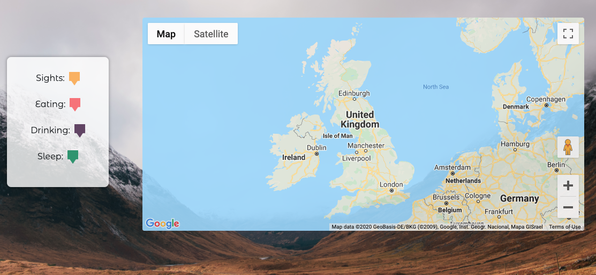
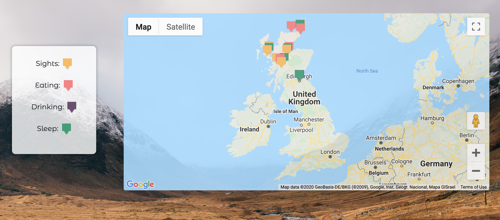
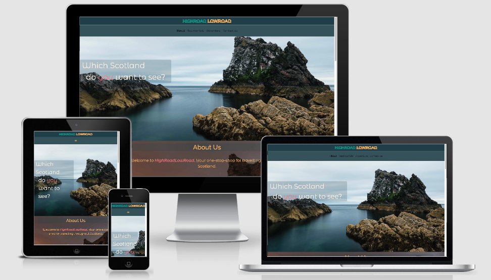

 

# High Road Low Road

## Description

Welcome to High Road Low Road - an online resource website that has been designed to highlight the spectacles a vacation could include, on a trip to Scotland. 
The site has been designed using one page, split into sections for ease of navigation. HTML and CSS were used, relying on Bootstrap for responsiveness on smaller
screen sizes and utilises Google Maps, to provide the user with a glimpse into the attractions, sights, and accommodation which may be beneficial on a trip to 
rural or urban Scotland. The site was designed with the intention that travellers interested in visiting Scotland, would enquire via the site Contact Form regarding 
further travel plans or highlights which hadn't been advertised. This is deter information, which could be site specific, from being copied by third parties.

## Deployment

This website has been deployed to Github pages and can be accessed by [clicking here.](https://lhbank.github.io/highroadlowroad/)

The steps I took to deploy this site to GitHub pages were as follows:

* I first selected the chosen repository, in this case, "HighRoadLowRoad".
* I then selected the 'Settings' tab, seen above the contents list of the repository.
* Scrolling down to the GitHub Pages subheading near the bottom of the page.
* When clicking on the dropdown menu box, and changing the option from "none" to "Master Branch".
* Once this page has automatically refreshed on changing this option, scroll down to the same Github Pages subheading, which now has a green highlighted box, 
confirming that the site has been published.

## User Experience (UX)

### User Stories

#### First Time Visitor Goals
* As a new user to the site, I want to be able to visit the site and understand its main purpose and is kept up-to-date.
* As a new user to the site, I want to be able to navigate easily through the site to find specific content regarding the site's purpose.
* As a new user to the site, I want to have the option to visit social media sites, related to HighRoadLowRoad.

#### Returning Visitor Goals
* As a returning user to the site, I want to be able to contact the proprietor and for any issues or further ideas regarding a vacation to Scotland.
* As a returning user to the site, I want to understand the designation of the colour coded markers with those of the markers on the interactive map.

#### Frequent User Goals
* As a frequent user of the site, I must be able to check for more recent testimonials published on the site, about the service HighRoadLowRoad
provide, as well as their presence and reputation within travel and tourism.

## Design 

### Colour Scheme
The colour theme chosen to style the included content was generated by Coolors. The colour palette was sampled against the animated logo
and resulted in 'Persian Green' for the "HighRoad" portion of the name, and 'Maximum Yellow Red' for the "LowRoad" portion. This theme was then
carried on throughout, with highlighted words carrying emphasised intonation, in 'Light Coral'. In addition to the consistent colour scheme, I
wanted to create the effect that all of the elements were suspended on the page, and as such applied a border shadow to all elements, not including
the section heading elements, and Google Map. This border shadow, in addition to the Scroll Reveal feature worked together effectively to create
the 3D effect.

### Typography
All font styles were extracted from Google Fonts. The title, HighRoadLowRoad, has been formatted with the font 'Montserrat Subrayada'. Throughout the site, 
consistent implementation of only two fonts was used. 'Raleway' was used against all heading and subheading elements, and 'Montserrat Alternates' against the 
text content and navigation links. Sans Serif was used as a substitute where the aforementioned custom fonts were not supported by selected browsers or devices.

### Imagery
With imagery being at the centre-point for captivating the user's attention, original images owned by William Marjoribanks were applied as background images. 
They could be altered using a custom radio button, within the lower footer of the site. This feature was not kept in local storage, as the site was not prioritised 
as a themeable site, however, was included to give the option of rural and urban imagery, likely to be seen whilst travelling throughout Scotland. 

### Wireframes
The wireframes created at the beginning of the project and used as a reference throughout are situated in a dedicated folder entitled 
['wireframes'](https://github.com/LHBank/highroadlowroad/tree/master/wireframes), 
at the same level as the homepage, 'index.html'. It contains screenshot images, for both the Mobile, Tablet, and Desktop viewport screen sizes, due to the use
of Bootstrap, and the prioritisation on Mobile-first devices.

# Features
* Interactive Google Map - Utilising the Google Maps API was fundamental to this project, and all relevant Javascript can be found in the map.js file. regarding
the custom markers, which were created using [Figma](https://www.figma.com), the image files can be found in the 'assets' directory under 'img'. 
* Interactive links to related social media networks, pertinent to travel and tourism.
* Contact Form - Using [Formspree.io](https://formspree.io/). Having used this trusted service for previous projects, knew this to be reliable.

# Technologies Used
* [ScrollReveal](https://unpkg.com/scrollreveal) - This open-source project listed in deployed GitHub pages, allowed elements within each section of the site 
to respond to the user scrolling down the page for the first time. The elements would enter the browser window from different viewpoints. This was used with 
Javascript and kept in a separate Javascript file from that of the Google Maps syntax, for clarity.

## Languages Used
* HTML5
* CSS3
* Javascript - Used within various key elements of the site, including Navbar, Collapse, Dropdown Menu, Carousel, Buttons. It was also used for the animated elements of
the site, such as the Animated Site Logo and Scroll Reveal Utility.

## Frameworks, Libraries & Programs Used
* [Bootstrap 4.5](https://getbootstrap.com/) - Bootstrap was utilised as a framework for CSS used throughout the site.
* [Popper.js](https://popper.js.org/) - Used for the navigation elements on Carousel elements used on the site.
* [jQuery](https://jquery.com/) - Used as a Javascript library by Bootstrap.
* [GitHub](https://github.com/) - GitHub was utilised for version control of the site.
* [Gitpod](https://www.gitpod.io/) - Gitpod was used during the project, as a virtual workspace environment.
* [Visual Studio Code](https://code.visualstudio.com) - This software had initially been used as a workspace environment, however, during site creation, it was revealed that 
Git requests and submissions, hadn't been implemented, and so switched to Gitpod to prevent any loss of content.
* [WireframeCC](https://wireframe.cc/) - This service was utilised to create sample wireframe guides to structure the content to be displayed on the site.
* [Google Fonts](https://fonts.google.com/) - Google Fonts was chosen to supply all fonts used throughout the site.
* [Font Awesome](https://fontawesome.com/) - FontAwesome was used for icons used in the footer.
* [Materialize](https://materializecss.com/) - Materialize was used for the 'Hamburger' menu item at the top of the page and the form 'Submit' button at page-end.
* [Coolors](https://coolors.co/) - This service, was used to generate a colour palette which would be used against all elements in a consistent theme throughout
 the site.
* Lightroom 4 - Pre-installed photography editing software used to compress the images used throughout the gallery pages.
* [TinyPNG](https://tinypng.com/) - was used to further compress all images used throughout the site.
* [Formspree.io](https://formspree.io/) - This tool was used to enable the user to contact the author/owner of the site, via a contact form on the Contact page.
* [Figma](https://www.figma.com) - This application was used to create an animated SVG that used Javascript on the initial loading of the site only.
* [ScrollReveal](https://unpkg.com/scrollreveal) - This open-source project listed in deployed GitHub pages, allowed elements within each section of the site to 
respond to the user scrolling. The elements would then enter the browser window from different viewpoints. This was used with Javascript.

# Testing

## Testing User Stories from User Experience (UX) Section

### First Time Visitor Goals
* As a first time user, I was able to see that the site used strong imagery to highlight key attractions within Scotland.
* As a first time user, I was able to navigate with ease throughout the site using the navbar at the head of the page, to each
dedicated section and had options linked to third-party sites.
* As a first time user, I was able to click on the social media links in the contact section of the site, via dedicated logos which I 
recognised immediately.

### Returning Visitor Goals
* As a returning user, I was able to click on colourful customised interactive markers on the map, placed in the "Adventure" section of the site, and understand their relevance. 
This made for ease of use and was familiar with how to control the map for my own purposes.
* As a returning user, I was able to send a message to the owner of HRLR to ascertain more information about a recommended attraction, advertised on the 
featured Google Map.
* As a returning user, I was able to click on the highlighted links after clicking on the coloured map markers, which would open a new page, to the relevant source.

### Frequent User Goals
* As a frequent user of the site, I liked the functionality of the interchangeable background images, which portrayed the different landscapes to be experienced, from
rural to urban, and would like to see more options in the future. I would also like the option to purchase these images as prints.
* As a frequent user, I know that if required, I can contact the site owner, via the contact form to enquire about attractions and listed highlights as to whether
they are deemed as safe and in line with government guidelines regarding the current COVID19 situation. I understood that from previous visits to the site, and discussion with
the site proprietor that the best way to ascertain more information - which may not yet be available on-site - can be provided using the contact form.

## Further Testing

### Error Resolution

#### Map Marker

During the final development stages of the HighRoadLowRoad project, an error presented itself which prevented the custom markers from displaying on the interactive Google Map.

Initially, on inspection and research, it was revealed that issues can arise if the markers aren't added to the initialised map variable within the relevant Javascript file.
However, on testing this theory before committing and pushing the changes to the master branch, found that wasn't the case. Instead, what needed to be amended 
was the location of the marker images whilst being processed by the for loop. This was the following result in the deployed site:

Simple errors such as this hadn't been noticed until testing, however I believe were fundamental to the User Experience, as without the custom marker, the dedicated marker legend
would have been redundant, and places of interest would not have been visible to the user.

#### Fixed Position Scrolling
On scrolling, the background images were set to a fixed position, of the browser window - excluding of course the scrollbar - to give the illusion that 
the text content was moving <em>around</em> the images. Having seen this used on many modern commercial websites, I thought that this would transition well between background images, 
however on testing, the images were distorted on smaller devices, and the effect wasn't identifiable. This was due to lack of support by browsers on smaller devices, and instead 
I chose to implement the open-source Scroll Reveal package, as mentioned.

### Scalability
Ideas to further develop the site's seamless use, and improved User Experience, would be to include radio buttons, which, using Javascript could interact
with the Google Maps API. For example, labelling two radio buttons: "City" and "Rural", then, when selecting the respective button, the relevant markers 
would appear on the Google Map. 

What would also benefit the site is to include an API which allowed for the user to organise UK-wide travel arrangements - which would enable the user to read the Highland destinations 
highlighted on the interactive Google Map. 

Another element to be added to improve the users experience, would be to add a "Featured Guides" section to the site, with approved tour providers who are interested in being advertised 
on HighRoadLowRoad.

### Speed Testing
To measure the speed of the site's loading, GTMetrix was used. [Clicking on this link](https://gtmetrix.com/reports/lhbank.github.io/xDU0IArs/), 
will open a new window with the report attached to HighRoadLowRoad.

# Credits

## Media

[Am I Responsive](http://ami.responsivedesign.is/?url=https%3A%2F%2Flhbank.github.io%2Fhighroadlowroad%2F) - This tool had been utilised to demonstrate the responsiveness 
that can be expected across various screen devices. In addition to using [Am I Responsive](http://ami.responsivedesign.is/?url=https%3A%2F%2Flhbank.github.io%2Fhighroadlowroad%2F),
the site across personal mobile devices in Opera, Safari and Chrome, and found the responsiveness to be the same.

## Content
The process for me to create a functioning site, inclusive of Javascript, required a great deal of extra research into understanding how to best serve the site's purpose. This meant
watching various tutorials and reading varied and detailed documentation for inspiration. The most crucial resources used to develop this project were as follows:

* [Code Institute](https://www.codeinstitute.net) - Continues to serve as my course provider and inspiration regarding coursework and projects.
* [Animated site-logo tutorial](https://www.youtube.com/watch?v=vJNVramny9k) - A YouTube tutorial published by DevEd, which incorporated the use of Figma to create
a unique animated logo.
* [Scotch.io](https://scotch.io/) - assisted in breaking down aspects of Javascript into more digestible parts.
* [Google Maps API Documentation](https://developers.google.com/maps/documentation/javascript/overview) - A thorough reference to the Google Maps API documentation, was crucial throughout the 
implementation of the interactive map on HighRoadLowRoad.